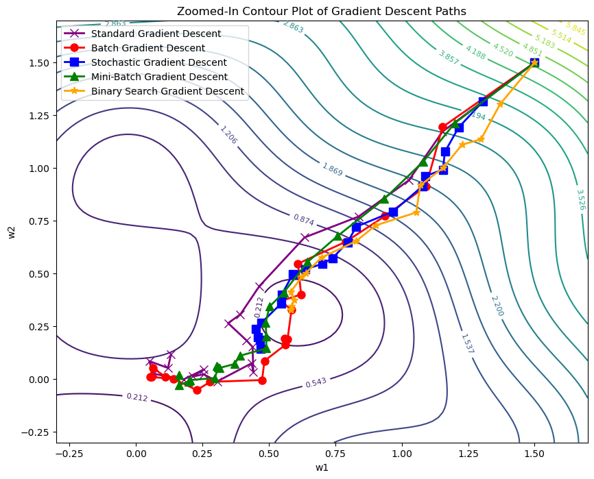
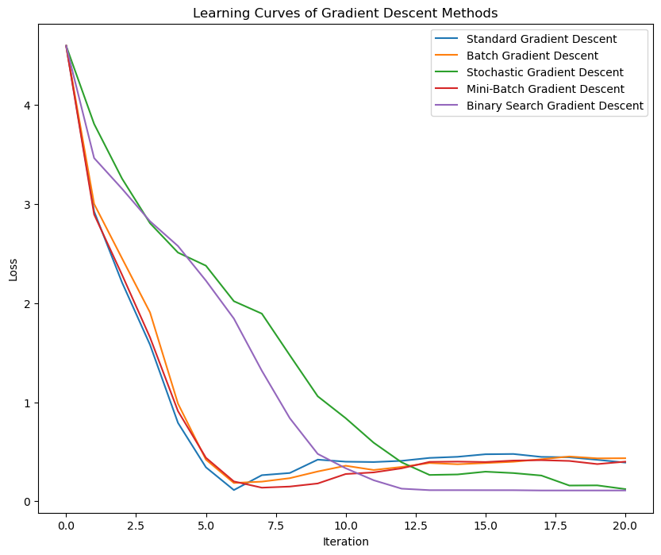

# Gradient Descent and Back-Propagation Tutorial

Welcome to the Gradient Descent and Back-Propagation Tutorial repository! This repository contains a Jupyter Notebook that explores various gradient descent optimization methods and their applications in training machine learning models. The notebook is designed to help users understand how these methods work, how they differ, and how to visualize their performance using learning curves.




This plot shows the paths taken by different gradient descent methods as they converge toward the minimum of the loss function.




This plot illustrates the learning curves of each gradient descent method, showing how quickly each method reduces the loss function over time.

## Overview

Gradient Descent is a fundamental optimization technique used in machine learning to minimize loss functions. In this tutorial, we cover the following gradient descent methods:

- **Standard Gradient Descent**
- **Batch Gradient Descent**
- **Stochastic Gradient Descent**
- **Mini-Batch Gradient Descent**
- **Binary Search Gradient Descent**

Each of these methods is implemented and visualized in the notebook to provide an intuitive understanding of how they work. We also introduce the concept of back-propagation, which is used in training neural networks.


## Getting Started

### Prerequisites

To run the notebook locally, you'll need to have the following installed:

- Python 3.x
- Jupyter Notebook
- Required Python packages (as listed in the `requirements.txt` file)

### Installation

1. Clone the repository to your local machine:

    ```bash
    git clone https://github.com/galenwilkerson/gradient-descent-back-propagation-tutorial.git
    ```

2. Navigate to the project directory:

    ```bash
    cd gradient-descent-back-propagation-tutorial
    ```

3. (Optional) Create a virtual environment:

    ```bash
    python3 -m venv venv
    source venv/bin/activate
    ```

4. Install the required packages:

    ```bash
    pip install -r requirements.txt
    ```

5. Open the Jupyter Notebook:

    ```bash
    jupyter notebook "Gradient Descent and Back-Propagation Tutorial.ipynb"
    ```

## Usage

The notebook is structured to guide you through the implementation and visualization of different gradient descent methods. Each section contains detailed explanations and code snippets that demonstrate how each method is implemented.

Simply run the cells in the notebook sequentially to generate the visualizations and learning curves.

## Contributing

If you'd like to contribute to this project, please fork the repository and create a pull request with your changes. We welcome improvements, bug fixes, and additional features!

## License

This project is licensed under the MIT License - see the [LICENSE](LICENSE) file for details.
